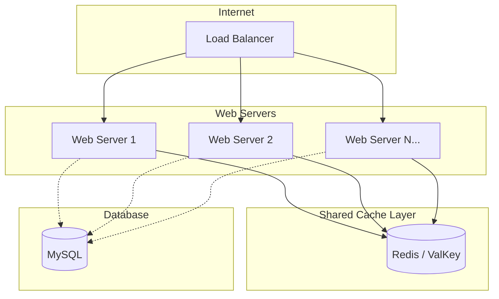
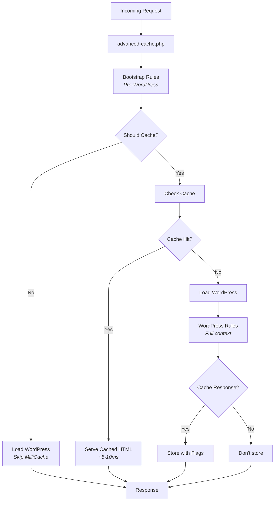

# Introduction

MilliCache is the most flexible Full Page Cache for scaling WordPress sites. 
It provides enterprise-grade in-memory caching using Redis, ValKey, Dragonfly, KeyDB, or any compatible Redis alternative.

## What is Full Page Caching?

Full page caching stores the complete HTML output of your WordPress pages in memory. 
When a visitor requests a cached page, MilliCache serves it directly from Redis without loading WordPress at all. This results in:

- **Response times under 10ms** instead of 200-2000ms
- **Dramatically reduced server load** — Database and WordPress are bypassed entirely
- **Better scalability** — Handle thousands of concurrent visitors
- **Improved SEO** — Search engines favor fast-loading sites

## Scale Your WordPress Infrastructure

One of MilliCache's most powerful capabilities is enabling **horizontal scaling**. Multiple web servers can share a single Redis instance, making it ideal for high-availability setups:

**Benefits of shared caching:**
- Any server can serve any cached page
- Cache is populated once, shared across all servers
- Cache invalidation propagates instantly to all servers
- No sticky sessions required for cached content
- Perfect for auto-scaling cloud environments

## Why Redis-Based Caching?

MilliCache uses Redis (or compatible alternatives) instead of files, database, or Memcache. Here's why:

| Storage      | Speed    | Scalability   | Shared Access  | Persistence  | Best For                   |
|--------------|----------|---------------|----------------|--------------|----------------------------|
| **Files**    | Slow     | Poor          | No             | Yes          | Single server, small sites |
| **Database** | Slow     | Limited       | Yes            | Yes          | Fallback only              |
| **Memcache** | Fast     | Good          | Yes            | No           | Simple key-value needs     |
| **Redis**    | **Fast** | **Excellent** | **Yes**        | **Optional** | **Production WordPress**   |

**Redis advantages:**
- Sub-millisecond latency for cache operations
- Rich data structures (flags stored efficiently)
- Atomic operations for cache invalidation
- Optional persistence for cache survival across restarts
- Cluster support for massive scale
- Active ecosystem with ValKey, KeyDB, Dragonfly alternatives

## Two Core Features: Flags & Rules

MilliCache's flexibility comes from two powerful features working together:

### Cache Flags

Each cached page is tagged with **flags** like `post:123`, `archive:post`, or `home`. 
When content changes, only related pages are invalidated—not the entire cache.

Learn more: [Cache Flags Documentation](../03-cache-flags/01-introduction.md)

### Caching Rules

Every caching decision is a **rule** you can customize. Think of it like smart home automation:

| Smart Home | MilliCache |
|------------|------------|
| "Turn off heating when I leave" | "Bypass cache when user is logged in" |
| "Dim lights after 10pm" | "Short TTL for breaking news posts" |

**You can create rules like:**
- Cache all pages **except** cart and checkout
- Use shorter TTL **for** archives, longer **for** single posts
- Bypass cache **when** a specific cookie exists
- Never cache **when** URL contains `?preview=true`

Learn more: [Rules Documentation](../04-rules/01-introduction.md)

## How It Works

## Additional Features

### Multisite Ready

Full support for WordPress Multisite:
- Per-site cache isolation
- Multi-network support
- Network-wide cache management
- Site-specific or network-wide configuration

### Developer Friendly

- Extensive WP-CLI commands
- REST API for remote management
- PHP functions for custom integrations
- Comprehensive hooks and filters

### Flexible Storage

Works with any Redis-compatible server:
- **Redis** — The original, most popular
- **ValKey** — Open-source fork, BSD licensed
- **KeyDB** — Multithreaded, higher throughput
- **Dragonfly** — Modern, memory efficient

## Requirements

| Component  | Requirement                                |
|------------|--------------------------------------------|
| PHP        | 7.4 or higher                              |
| WordPress  | 5.6 or higher                              |
| Storage    | Redis, ValKey or another compatible server |

> [!TIP]
> For best performance, run your Redis server on the same machine as WordPress or use a low-latency network connection.

## Next Steps

Ready to get started? Continue to:

- [Installation & Quick Start](./20-installation.md) — Install and configure MilliCache
- [Cache Flags](../03-cache-flags/01-introduction.md) — Understand targeted invalidation
- [Rules](../04-rules/01-introduction.md) — Control caching behavior
