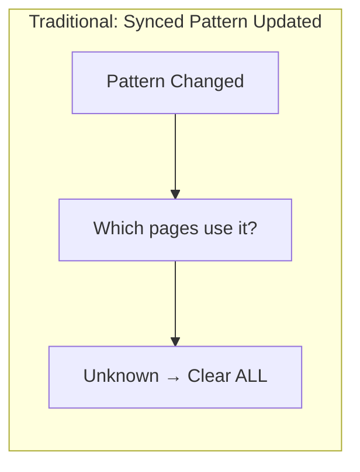
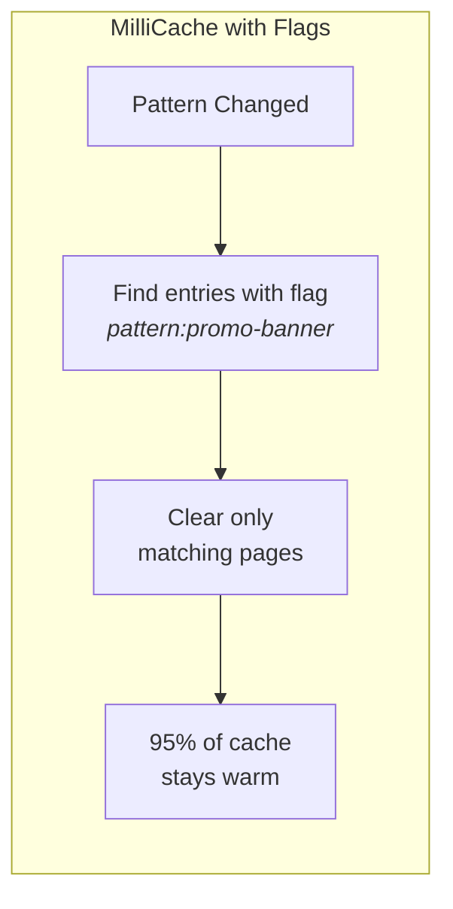
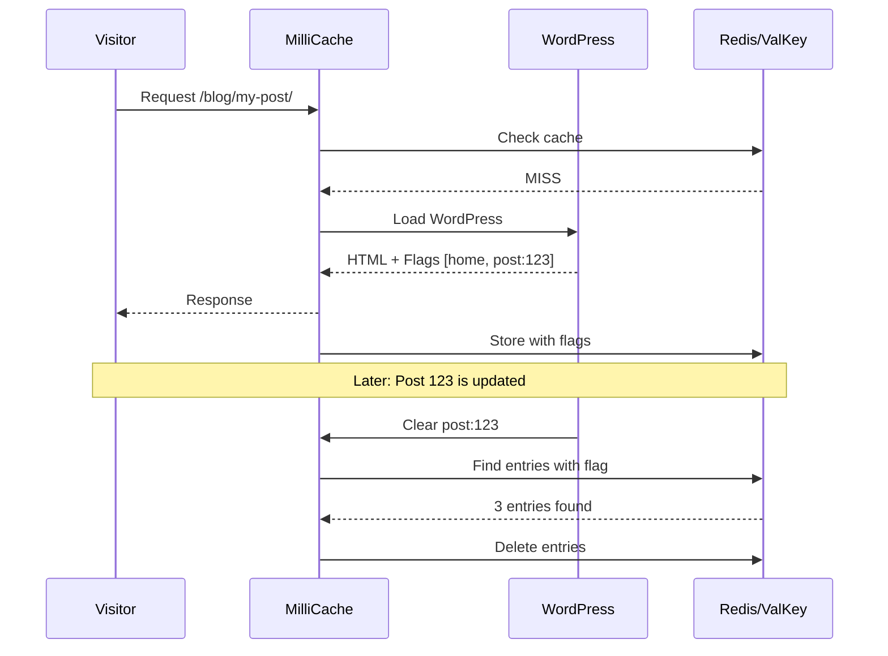

# Introduction to Cache Flags

Cache flags are one of MilliCache's most powerful features. 
They enable **targeted cache invalidation** — clearing only the cache entries that actually need updating, rather than wiping everything.

## The Challenge of Modern WordPress

Most caching plugins handle basic scenarios well — when a post is updated, they clear that post's cache and related archives. 
But WordPress is evolving rapidly with Gutenberg's modernization phases, creating new challenges.

### The Synced Pattern Problem

Consider **Synced Patterns** (reusable blocks) and **FSE Template Parts**. 
A single pattern might appear on dozens or hundreds of pages across your site:

- A promotional banner in your header template
- A newsletter signup block used across blog posts
- A pricing table embedded in multiple product pages

When you update that synced pattern, **which pages need their cache cleared?**

Traditional caching plugins have no way to know. 
Their only safe option is to **flush the entire site cache** — even if the pattern only appears on 5% of your pages.

### How Flags Solve This

MilliCache tags each cached page with **flags** — labels describing what content appears on that page. 
You can create flags for patterns, template parts, or any content relationship.

This becomes increasingly important as WordPress moves toward Full Site Editing, where template parts and patterns are shared across many pages.

## Real-World Analogy

Think of cache flags like **tags on photos** in your photo library:

- You tag photos with "vacation", "2024", "beach", "family"
- Later, you can find all "beach" photos instantly
- Deleting one tag doesn't affect others
- Photos can have multiple tags

Similarly, MilliCache pages can have multiple flags, and you can target specific flags for clearing.

## Why Single Pages Need Multiple Flags

A single URL can generate different cache entries based on:

- Query parameters (`?page=2`, `?sort=price`)
- Cookies (language preferences, currency)
- Other request variations

All these entries relate to the same content but have different cache keys. Flags group them logically:

| URL                        | Cache Key  | Flags                        |
|----------------------------|------------|------------------------------|
| `/product/shoe/`           | `abc123`   | `post:45`, `archive:product` |
| `/product/shoe/?color=red` | `def456`   | `post:45`, `archive:product` |
| `/product/shoe/reviews/`   | `ghi789`   | `post:45`, `archive:product` |

When the product is updated, clearing `post:45` removes all three entries — exactly what you need.

## Benefits of Flag-Based Invalidation

### Performance
- Cache stays warm for unaffected pages
- Less database load during updates
- Faster recovery after content changes

### Precision
- Update a post → only that post's pages cleared
- Update a category → only that category's archives cleared
- No collateral damage to unrelated content

### Flexibility
- Create custom flags for your specific needs
- Use wildcards for broad clearing (`post:*`)
- Integrate with your content workflow

## How Flags Flow Through MilliCache

## Next Steps

- [Built-in Flags](02-built-in-flags.md) — Flags automatically assigned by MilliCache
- [Custom Flags](03-custom-flags.md) — Create your own flags for advanced control
- [Cache Clearing](../05-usage/20-cache-clearing.md) — Methods for clearing cache by flags
