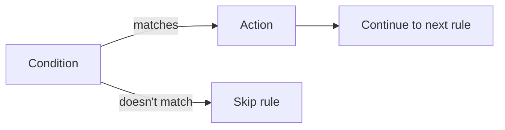
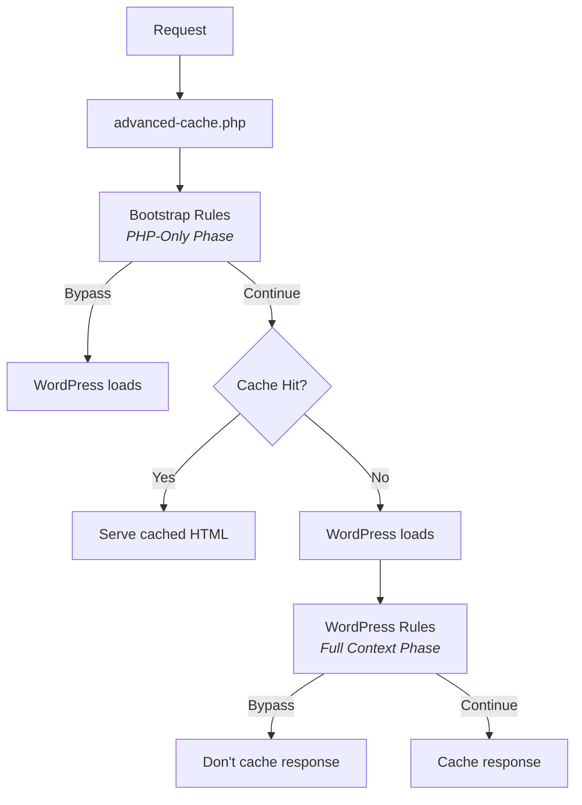

# Introduction to Rules

Rules are MilliCache's second core feature. While [Cache Flags](../03-cache-flags/01-introduction.md) handle **what** to clear, rules control **when** to cache.

Together, flags and rules make MilliCache incredibly flexible:

- **Rules** decide: Should this request be cached? For how long?
- **Flags** decide: When content changes, which cache entries are affected?

## Why Rules?

Every caching decision in MilliCache is a **rule**. This means you can:

- Override any default behavior
- Add your own conditions
- Customize for your specific use case

Think of it like **smart home automation for your cache**:

| Smart Home                                                  | MilliCache                                                                   |
|-------------------------------------------------------------|------------------------------------------------------------------------------|
| "Turn off heating **when** I leave home"                    | "Bypass cache **when** user is logged in"                                    |
| "Turn on lights **when** it's dark **and** motion detected" | "Bypass cache **when** it's a POST request **and** URL contains `/checkout`" |
| "Set temperature to 18° **when** it's after 10pm"           | "Set TTL to 5 minutes **when** page is a product archive"                    |

## How Rules Work

Every rule has three parts:



| Component     | Description                        | Example                                     |
|---------------|------------------------------------|---------------------------------------------|
| **Condition** | When should this rule apply?       | "If user is logged in"                      |
| **Action**    | What should happen?                | "Do not cache"                              |
| **Priority**  | When to evaluate (lower = earlier) | `0`/`1` (built-in), `10+` (custom)          |

## The Fluent API

Rules use a readable, chainable syntax powered by [MilliRules](https://www.millipress.com/docs/millirules/):

```php
millicache()->rules()->create( 'mysite:example-rule' )  // Create rule with an ID
    ->order( 10 )                                      // Set priority
    ->when()                                           // Start conditions
        ->request_url( '/news/*' )                     // Match URL pattern
    ->then()                                           // Start actions
        ->set_ttl( 1800 )                              // Set 30-minute TTL
    ->register();                                      // Register the rule
```

The phase is picked for you: MilliCache reads the conditions and actions you used,
and a rule that could only have run before WordPress is moved to the WordPress phase,
since that earlier phase is over by the time your code runs.

One thing is on you: **register after MilliCache has loaded.** In a plugin or a theme
that is already the case. Only a file that runs earlier, such as a must-use plugin,
needs the registration wrapped in `add_action( 'plugins_loaded', … )`; see
[where to put the code](03-examples.md#where-to-put-the-code).

Prefer building rules without code? [MilliCache Pro](https://www.millipress.com/millicache-pro/) includes a [visual Rules Builder](https://www.millipress.com/docs/millicache-pro/02-modules/03-rules-builder/): create, edit, and reorder caching rules directly in the settings screen, in addition to the PHP API.

## Two Execution Phases

MilliCache rules execute in two distinct phases:



### Bootstrap Phase (`php`)

Runs **before WordPress loads**:
- Instant decisions with minimal overhead
- No database queries
- Can only check: URL, cookies, headers, constants

This phase runs inside `advanced-cache.php`, before any plugin or theme exists, so
**it cannot be reached from code**. Bootstrap rules come from the settings, which the
drop-in reads from the database. Writing them takes
[MilliCache Pro](https://www.millipress.com/millicache-pro/): either its
[Rules Builder](https://www.millipress.com/docs/millicache-pro/02-modules/03-rules-builder/)
or `wp millicache rules import`.

### WordPress Phase (`wp`)

Runs **after WordPress loads**:
- Full WordPress context available
- Can check: user roles, post types, templates, etc.
- More powerful but slightly later in the request

## Built-in Rules

MilliCache includes sensible defaults that you can override:

- Never cache POST requests
- Never cache logged-in users
- Never cache admin/CLI/REST/AJAX requests
- Respect `DONOTCACHEPAGE` constant
- Honor excluded cookies and paths from settings

See [Built-in Rules](02-built-in-rules.md) for the complete list.

## What You Can Do

With rules, for example, you can:

**Control caching decisions:**
```php
->then()->do_cache( false, 'Reason' )   // Bypass cache
->then()->do_cache( true )              // Force cache (override previous)
```

**Adjust cache timing:**
```php
->then()->set_ttl( 3600 )    // Cache for 1 hour
->then()->set_grace( 86400 ) // Allow stale for 1 day
```

**Manage flags:**
```php
->then()->add_flag( 'custom:flag' )
->then()->remove_flag( 'home' )
```

**Clear cache:**
```php
->then()->clear_cache( ['post:123', 'home'] )
->then()->clear_site_cache()
```

## Learn More

For deep documentation on the rules engine, conditions, actions, and patterns:

**[MilliRules Documentation](https://www.millipress.com/docs/millirules/)**

- [Core Concepts](https://www.millipress.com/docs/millirules/02-core-concepts/)
- [Conditions Reference](https://www.millipress.com/docs/millirules/05-reference/01-conditions/)
- [Actions Reference](https://www.millipress.com/docs/millirules/05-reference/02-actions/)

To manage rules visually instead, see the [Rules Builder](https://www.millipress.com/docs/millicache-pro/02-modules/03-rules-builder/) in MilliCache Pro.

## Next Steps

- [Built-in Rules](02-built-in-rules.md) — All default rules and when they run
- [Examples](03-examples.md) — Practical MilliCache rule examples
- [Cache Flags](../03-cache-flags/01-introduction.md) — The partner feature to rules
